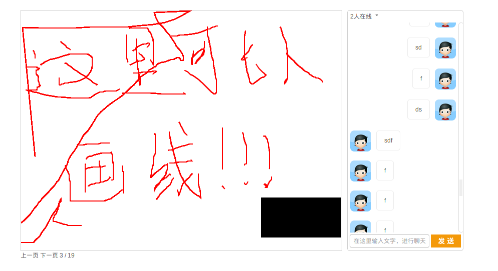

## 实时客户端

基于Html5实现

### Demo

### 项目结构

- **Server** 存放与服务器交互的后台代码

- **Client** 前端页面

    - js 存放javascript等脚本

    - css 存放css样式表

    - img 存放项目相关的图片

- **Docs** 项目开发文档， 统一采用markdown语法编写. 每开发一个新项目需要更新相应的文档

- **Test** 测试目录，用于日常开发的测试所需.

    - js

    - img

    - css

    - html html文件存放在此

- **index.html** 入口文件，也是主要的显示界面, 就目前来说应该就这个一个html文件.

### 开发相关

1. Node.js做后台

2. 前端主要技术HTML5

### 线下部署注意事项

1.`node.js`版本最好1.0以上

2.启动服务器脚本的时候需要安装`ws`模块

    $ sudo npm install -g ws # 安装到全局

    # 出现的问题：在某些系统中，导致项目目录权限不够即使安装了ws模块也无法require
    # 所以最好安装在local，或者用link软链接一下
    $ sudo npm link <ModuleName> # sudo npm link ws

3.需要apache环境的支持

把整个项目放到`www`或`htdocs`目录下,

然后访问：[http://localhost/chat/Client](http://localhost/chat/Client)

4.目前的用户身份识别

    {
        uid: 100, // 用户id
        uname: 'luofei',
        urole: 'student',
        uavatar: 'http:....jpg' // 用户头像
    }

### 项目进展

#### 2013-08-17

1. 聊天功能(80%)

2. PPT划线

#### 2013-08-20

1. 音视频功能

2. 聊天功能

#### 2013-08-23

1. PPT显示

2. PPT翻页

3. 在线列表

#### 2013-08-27

1. 使用cluster模块实现多进程服务器

2. 实现子进程自动重启

### 计划方向

1. 流媒体

2. 音视频

3. PPT直播, js的PDF解码器，带滑动效果

4. 在线列表

5. 初步开始提供注册功能，有头像，用户id，名称。

6. 添加表情功能
